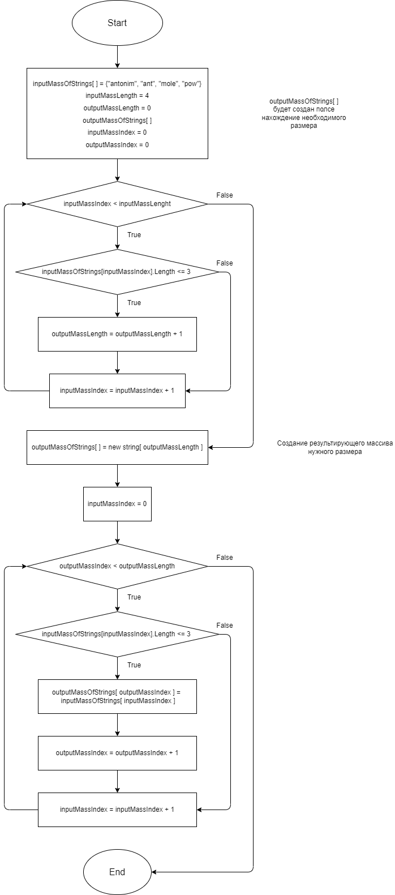

## __Задание__

Имеется массив строк. Необходимо создать новый массив строк, состоящий из строк данного, длина которых меньше или рава 3 сиволам.

## __Алгоритм решения__

1. Создаем метод, который принимает в качестве аргументов исходный массив и количество элементов в нем (его размер);
2. Внутри метода используем цикл *__while__*, перебирая элементы исходного массива, считаем количество строк, удовлетворяющих требованию (строки длинной меньше или равной 3 символам);
3. Создаем новый массив необходимого размера;
4. Использем цикл _**while**_, перебирая элементы исходного массива, заполняем новый массив строками, удовлетворяющих требованию (строки длинной меньше или равной 3 символам);

## **Блок-схема**

## __Ссылка на репозиторий__

[Репозиторий с решением](https://github.com/Chell406/Total-project-GB)